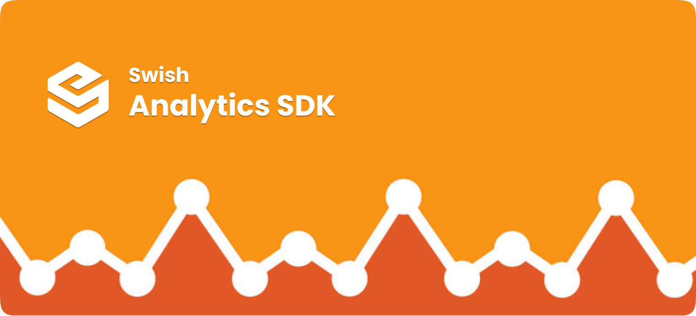

## What It Is
> Swish Analytics SDK helps you to track user events , user attributes.It provide multiple analytics plugins to track data and it helps you to easily integrate different analytics SDK as per your need.This acts as a central SDK for all your analytics needs.

This Website contains all information for Swish Analytics SDK and will cover architecture, documentaion and know on how to build? how to integrate and collaborate on the project. If you are interested in a quick integration please click below for a quick start guide.

<a class="learn-more btn-learn" target="_blank" href="pages/telco-cloud/swish-analyticssdk-android/QuickIntegration.md">
    
        
    
    <i>Quick Start</i>
</a>

# Why we need SDK
> As we have multiple different analytic SDKs and our own in-house analytic server, each of these has a different need that is the reason we have Analytic as a SDK which can do all housekeeping work and end application can very quicky integrate multiple analytics plugins and track user data on different analytic server.

If we look closely all common components remain same the only change is the content and some plugin specific extra param(s).so can swap or pick required plugin and build it according to your needs and you will get the desired data tracking.

# Features

- Empowering end application to quickly integrate & track data across multiple analytic plugins.
- As per need basis plugin integration
- Light weight as SDK size will be base on what plugins application choose to track data
- very easy to integrate & track data

